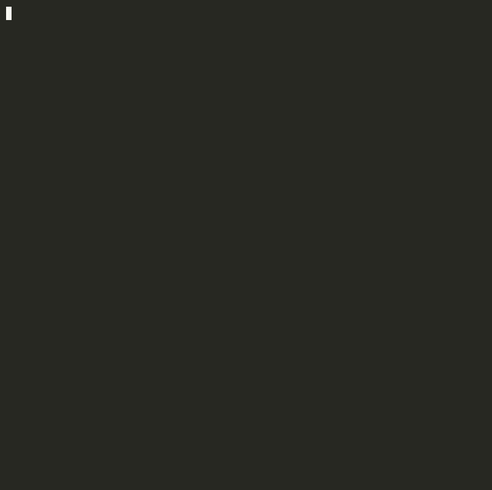

<div align="center">


**Find what you forgot to hide.**

<sub>Zero-config security audit for your dev environment. One command.</sub>

<br>

[](https://python.org)
[](LICENSE)
[](https://github.com/KazamaDono/exposed)

<br>



</div>

---

## `> cat /etc/motd`

```
Most secret scanners focus on your git history.
exposed focuses on your actual machine.
```

The SSH keys, shell history, dotfiles, running services, and file permissions that attackers target after initial access. It's the audit you should run on every dev machine, CI runner, and cloud instance.

---

## `> exposed --checks`

<div align="center">

| Check | What it finds |
|:---:|---|
| **SSH Keys** | Weak algorithms (DSA, short RSA), missing passphrases, wrong file permissions |
| **Git Config** | Plaintext credential storage, unsigned commits, missing global gitignore, secrets in gitconfig |
| **Secrets** | API keys, tokens, passwords, connection strings in `.bashrc` `.zshrc` `.profile` `.env` |
| **History** | Credentials passed inline to `curl`, `mysql`, `docker`, `psql` and more |
| **Permissions** | Overly permissive `.aws/credentials`, `.kube/config`, `.npmrc`, private keys in ~/Downloads |
| **Network** | Databases, caches, Docker listening on `0.0.0.0` instead of localhost |
| **Docker** | World-accessible socket, containers running as root |

</div>

---

## `> sudo pip install exposed-cli`

```bash
pip install exposed-cli
```

Or from source:

```bash
git clone https://github.com/KazamaDono/exposed.git
cd exposed && pip install .
```

---

## `> exposed --help`

```bash
exposed                        # full scan
exposed -q                     # critical + warning only
exposed --json                 # machine-readable output
exposed --checks ssh,network   # run specific checks
exposed --no-banner            # skip the ASCII art
```

---

## `> exposed --json | jq`

Exits with code `1` on critical findings. Drop it into any pipeline.

```yaml
# GitHub Actions
- name: Security audit
  run: |
    pip install exposed-cli
    exposed --json > audit.json
    exposed -q
```

```bash
# Filter criticals
exposed --json | jq '.results[] | select(.findings[] | .severity == "critical")'
```

---

## `> ls /opt/checks/`

```
ssh          key algorithms, passphrases, permissions
git          credential storage, commit signing, gitignore
secrets      secrets in dotfiles and .env files
history      credentials leaked in shell history
permissions  file permissions on sensitive config files
network      services exposed beyond localhost
docker       socket permissions, container user context
```

```bash
exposed --checks ssh,git,permissions
```

---

<div align="center">

<sub>Built by <a href="https://github.com/KazamaDono">@KazamaDono</a></sub>

<br>


</div>
