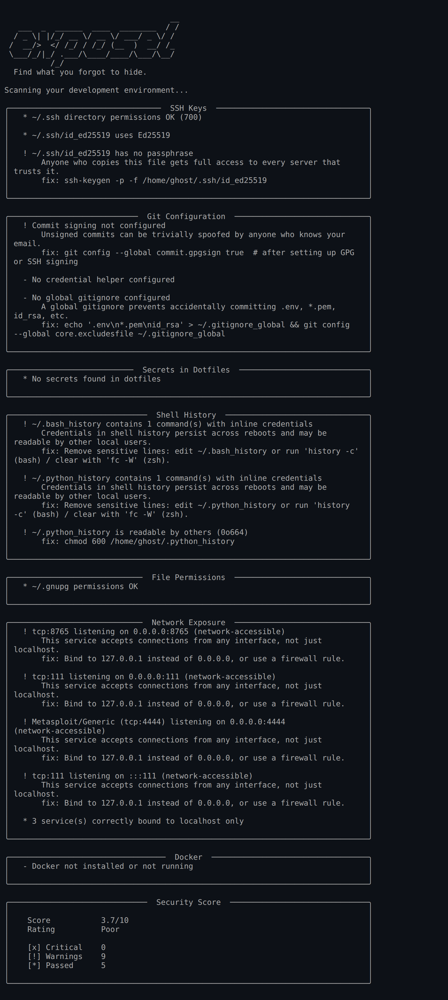

<p align="center">
  <br>
  <code>exposed</code>
  <br>
  <strong>Find what you forgot to hide.</strong>
  <br>
  <br>
  <a href="#install">Install</a> &middot;
  <a href="#what-it-checks">Checks</a> &middot;
  <a href="#usage">Usage</a> &middot;
  <a href="#cicd-integration">CI/CD</a>
  <br>
  <br>
</p>

A fast, zero-config CLI that audits your development environment for security misconfigurations and leaked secrets. One command. No setup.

<p align="center">
  
</p>

---

## Why exposed?

Most secret scanners focus on your **git history**. `exposed` focuses on your **actual machine** — the SSH keys, shell history, dotfiles, running services, and file permissions that attackers target after initial access.

It's the security audit you should run on every dev machine, CI runner, and cloud instance.

## What it checks

| Check | What it looks for |
|-------|-------------------|
| **SSH Keys** | Weak algorithms (DSA, short RSA), missing passphrases, wrong file permissions |
| **Git Config** | Plaintext credential storage, unsigned commits, missing global gitignore, secrets in gitconfig |
| **Secrets in Dotfiles** | API keys, tokens, passwords, connection strings in `.bashrc`, `.zshrc`, `.profile`, `.env` |
| **Shell History** | Credentials passed inline to curl, mysql, docker, psql, and other commands |
| **File Permissions** | Overly permissive sensitive files (`.aws/credentials`, `.kube/config`, `.npmrc`, etc.) |
| **Network Exposure** | Dev services (databases, caches, Docker) listening on `0.0.0.0` instead of localhost |
| **Docker** | World-accessible socket, containers running as root |

## Install

```bash
pip install exposed-cli
```

Or from source:

```bash
git clone https://github.com/KazamaDono/exposed.git
cd exposed
pip install .
```

## Usage

```bash
exposed                        # full scan
exposed -q                     # critical + warning findings only
exposed --json                 # machine-readable output
exposed --checks ssh,network   # run specific checks
exposed --no-banner            # skip the ASCII art
```

## CI/CD Integration

`exposed` exits with code `1` when critical findings are detected.

```yaml
# GitHub Actions
- name: Security audit
  run: |
    pip install exposed-cli
    exposed --json > audit.json
    exposed -q
```

Filter critical findings from JSON output:

```bash
exposed --json | jq '.results[] | select(.findings[] | .severity == "critical")'
```

## Available Checks

```
ssh          SSH key algorithms, passphrases, permissions
git          Credential storage, commit signing, gitignore
secrets      Secrets in dotfiles and .env files
history      Credentials leaked in shell history
permissions  File permissions on sensitive config files
network      Services exposed beyond localhost
docker       Socket permissions, container user context
```

Run a subset:

```bash
exposed --checks ssh,git,permissions
```

## Requirements

- Python 3.9+
- Linux or macOS
- Docker CLI (optional, for container checks)

## License

MIT
